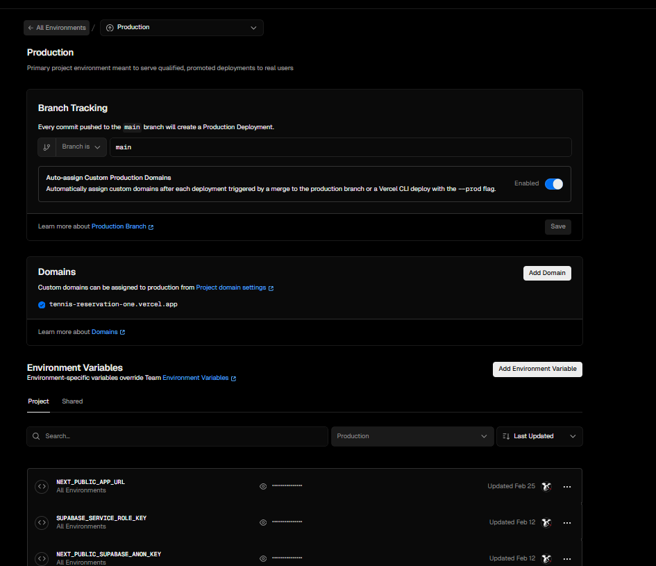

# テニスコート予約システム

完全無料のテニスコート予約システム。会員登録必須（セキュリティ強化のためゲスト予約は廃止）。コート2面（コートA・コートB）の予約管理に対応。

アプリURL：　https://tennis-reservation-five.vercel.app/login

---

## システム全体構成

このシステムは **ソース（GitHub）→ ビルド・配信（Vercel）→ 実行時のデータ（Supabase）** でつながる。**どの GitHub リポジトリをどの Vercel プロジェクトが見ているか**で、デプロイ先と接続する Supabase が決まる（下表のペア）。

### 変更が本番に届くまで（開発〜デプロイ）

開発者がローカルでコミットし、**決められた GitHub リポジトリ**のブランチ（多くは `main`）に変更が入ると、**Vercel が GitHub からコードを取得**してビルドし、本番（またはプレビュー）URL に反映する。

```
  [ 開発者 PC ]
  （vault モノレポ内の tennis-reservation/ などで編集・コミット）
           │
           │  git push（または PR マージで main が更新）
           ▼
  [ GitHub ]
  ・元環境 … TatsuhitoDT/vault（テニスは tennis-reservation/）
  ・コピー環境 … iparkadmin/tennis-reservation
           │
           │  Git 連携（Webhook）でデプロイ開始
           ▼
  [ Vercel ]
  ・指定の Root Directory で npm install / next build 等
  ・環境変数（Supabase URL・キー等）を注入
  ・ビルド成果物をエッジ／サーバレス上にデプロイ
           │
           │  公開 URL（*.vercel.app 等）
           ▼
  [ 利用者・ブラウザ ] ──HTTPS──► 上記と同じ Vercel 上の Next.js
```

- **元環境**: `main` にマージなどで GitHub が更新 → **mtatsuhito-gmailcoms-projects** 側の該当プロジェクトがビルド（vault 接続時は Root Directory **`tennis-reservation`**）。
- **コピー環境**: `iparkadmin/tennis-reservation` の `main` が更新 → **muramatsus-projects / tennis-reservation** がビルド。

### 本番アクセス時（実行時のデータの流れ）

利用者がブラウザから Vercel の URL にアクセスしたあと、アプリは **Supabase** と通信して認証・DB を扱う。

```
  [ 利用者・ブラウザ ]
           │  HTTPS
           ▼
  [ Vercel 上の Next.js（app/） ]
           │
           ├── API / クライアント SDK ──► [ Supabase Auth ]
           │
           └── データ読み書き ──────────► [ PostgreSQL（Supabase） ]
```

| レイヤ | 役割 |
|--------|------|
| **ソース管理** | **GitHub** … 正規のリポジトリ・ブランチにコードが集まる。PR・履歴・Vercel の取り込み元。 |
| **ビルド・ホスティング** | **Vercel** … GitHub と連携し push / マージをトリガにビルド・デプロイ。本番 URL の提供、環境変数、プレビュー環境。 |
| **アプリケーション** | `app/` … Next.js（予約 UI、管理画面、API Routes）。ビルド対象は Vercel プロジェクトの Root Directory 設定に従う。 |
| **BaaS** | **Supabase** … 会員認証、予約・コート等のデータ、RLS、メール連携の土台（環境ごとに別プロジェクト）。 |

### Supabase 無料プランとポーズ防止（GitHub Actions）

**無料プラン**では、**約 7 日間プロジェクトにアクティビティがない**と **ポーズ（一時停止）** される。さらに **放置が続くと復活できなくなる**（事実上の削除に近い扱い）可能性があるため、**定期的に DB に触れる**運用で防いでいる。

- **対策**: リポジトリ **`TatsuhitoDT/vault`** の **GitHub Actions** ワークフロー（`.github/workflows/tennis-supabase-keep-alive.yml`、表示名 *Tennis Reservation - Supabase Keep Alive*）が **週 2 回**（**日曜・水曜 09:00 UTC**）スケジュール実行され、**PostgreSQL に直接接続**して `SELECT 1` 等を実行し、アクティビティを発生させる（REST だけでは不十分なため直結）。
- **注意**: ワークフローが **エラーで失敗し続ける**と（Repository Secrets の未設定・誤り、接続 URI の失効、一時的な障害など）、**意図どおり DB に届かずポーズ防止にならない**。**Actions タブで成功／失敗をときどき確認**し、**赤い失敗が続いていないか**を見ること。手動再実行は `workflow_dispatch` でも可能。
- **Secrets・コピー環境の DB も触る設定**など: `docs/deployment/15_supabase_keep_alive_setup.md`

運用上は **元環境**と **コピー環境**の **2系統**があり、**GitHub・Vercel・Supabase の組み合わせを取り違えない**こと（下表）。

### 環境一覧（作業前確認・間違い防止）

**GitHub と Vercel は次のペアで固定。入れ替えないこと**（誤るとデプロイ・環境変数・Supabase が別環境に向く）。

| 環境 | GitHub | Vercel チーム / プロジェクト | Vercel Domain（公開URL） | Supabase org | Supabase project ref | Region |
|---|---|---|---|---|---|---|
| **元環境** | [TatsuhitoDT/vault](https://github.com/TatsuhitoDT/vault) | チーム [mtatsuhito-gmailcoms-projects](https://vercel.com/mtatsuhito-gmailcoms-projects) | https://tennis-reservation-one.vercel.app | [dfiufvdhbtaitktitzwh](https://supabase.com/dashboard/org/dfiufvdhbtaitktitzwh) | **`yawzyrzfbphxrthlrzjg`** | `ap-southeast-1` (Singapore) |
| **コピー環境** | [iparkadmin/tennis-reservation](https://github.com/iparkadmin/tennis-reservation) | プロジェクト [muramatsus-projects / tennis-reservation](https://vercel.com/muramatsus-projects/tennis-reservation) | https://tennis-reservation-five.vercel.app | [qtgzpqlzgojkjwsigvww](https://supabase.com/dashboard/org/qtgzpqlzgojkjwsigvww) | **`tyvhzenwdiiwzpldvbrf`** | `ap-northeast-1` (Tokyo) |

> **元環境の region について**: 元環境のみ Singapore（コピー環境は Tokyo）。Supabase は既存プロジェクトの region 変更を**サポートしていない**（新規プロジェクト作成 + 全データ移行が必要）。テニス予約用途ではレイテンシ差が体感に影響しないため、移行はせず**現状維持**とする。参照: [Supabase Docs](https://supabase.com/docs/guides/troubleshooting/change-project-region-eWJo5Z)。

#### 直リンク（クリックで該当画面へ）

| 用途 | 元環境 | コピー環境 |
|---|---|---|
| Supabase ダッシュボード | https://supabase.com/dashboard/project/yawzyrzfbphxrthlrzjg | https://supabase.com/dashboard/project/tyvhzenwdiiwzpldvbrf |
| Supabase SQL Editor | https://supabase.com/dashboard/project/yawzyrzfbphxrthlrzjg/sql/new | https://supabase.com/dashboard/project/tyvhzenwdiiwzpldvbrf/sql/new |
| Supabase API Settings | https://supabase.com/dashboard/project/yawzyrzfbphxrthlrzjg/settings/api | https://supabase.com/dashboard/project/tyvhzenwdiiwzpldvbrf/settings/api |
| Supabase Auth URL Config | https://supabase.com/dashboard/project/yawzyrzfbphxrthlrzjg/auth/url-configuration | https://supabase.com/dashboard/project/tyvhzenwdiiwzpldvbrf/auth/url-configuration |
| Vercel デプロイ画面 | https://vercel.com/mtatsuhito-gmailcoms-projects | https://vercel.com/muramatsus-projects/tennis-reservation/deployments |

（最新 Deployment URL は変動するため記録しない。常に Vercel の Deployments タブを正とする。）

#### マンダトリ：作業前・push 前・GitHub 承認前（取り違えゼロ）

1. **今回どちら向けか一言で決める**：元環境／コピー環境／両方。**環境が書かれていないとき、AI・自動化は iparkadmin 向けスクリプトや `iparkadmin` への push を実行せず、先に「元／コピー／両方」を確認する**（無用な iparkadmin 試行を防ぐ）。運用の詳細は `docs/deployment/ENVIRONMENT_WORKFLOW_RULE.md`。
2. **上表と一致しているか確認**：Git の remote・Vercel の「Connected Git Repository」・Supabase ダッシュボードの org・GitHub の OAuth 画面に出る **organization / repository** が、選んだ環境の行だけを指していること。
3. **GitHub OAuth・GitHub App・リポジトリ選択で間違った行が表示されたら即ストップ**：承認・インストールを**完了させない**（ブラウザでキャンセル／拒否）。正しい行は次のとおり。
   - **コピー環境向け** … 承認対象に **`iparkadmin`** と **`iparkadmin/tennis-reservation`** が含まれること。
   - **元環境向け** … 承認対象に **`TatsuhitoDT/vault`**（`TatsuhitoDT`）が含まれること。
   - **承認画面の主対象が、本番の正である `TatsuhitoDT`（元）または `iparkadmin`（コピー）のどちらも含まない**… **誤承認の可能性が高い**。キャンセルし、意図した環境に合わせてアカウント／org を切り替えてからやり直す。
4. **元環境だけ**を更新するとき（「コピーは後」「iparkadmin にプッシュしない」など）… **`iparkadmin` リモート・clone・`publish-iparkadmin-copy.ps1`・`push-iparkadmin.ps1` は使わない**。**`TatsuhitoDT/vault` の `origin` へ**ブランチ push → PR → `main` マージでデプロイする。
5. **誤承認に気づいたら**：ただちに当該 GitHub の Settings → Applications（または Organization の Third-party access）で権限を見直し、**誤って付与したアクセスを削除**したうえで、**正しい org/repo だけ**で付け直す。

AI（Cursor 等）向けの強制ルールは **リポジトリルート**の `.cursor/rules/tennis-reservation-environments.mdc` と `CLAUDE.md` の「tennis-reservation の環境」を参照。

**元環境とコピー環境の意味（運用方針）**

- **元環境** … **村松が最初に開発した**ときの系統（モノレポ `vault` と個人側 Vercel チーム等）。開発の起点・検証に使う側面がある。
- **コピー環境** … **公開・共有用にコピー**した系統（単独リポジトリ `iparkadmin/tennis-reservation` と muramatsus 側 Vercel 等）。外向きのデプロイの主たる載せ先。
- **両環境のアプリは、可能な限り同じ状況（同じ機能・同じコードベース）を維持する**ことを目指す。Supabase は org／プロジェクトが分かれているため **データは別**だが、**スキーマやアプリの改修は揃える**運用とする。
- 手順の優先度（人間向け）: 公開用を先に揃えたいときは**コピー環境を先**にしてよい。**AI は「先に iparkadmin」と推測して iparkadmin 経路を自動実行しない**（環境未指定なら確認）。元環境だけを変えたいときは「元環境で」と明示する。
- **元環境とコピー環境の切り分け**: コピー環境（公開用）へ反映するときは **GitHub の `iparkadmin/tennis-reservation` に向けて push する**（`push-iparkadmin.ps1` / `publish-iparkadmin-copy.ps1` または同リポジトリへの手動 push）。**個人アカウントの別リポジトリだけに push してコピー環境のデプロイを済ませる、といった取り違えをしない。**

- 詳細: `docs/deployment/ENVIRONMENT_WORKFLOW_RULE.md`
- Vercel の環境変数（4キー）が誤って上書きされた場合: `docs/deployment/VERCEL_FOUR_KEYS_RECOVERY_AND_PREVENTION.md`
- **Deployments で先に iparkadmin 名義の Blocked Preview が並ぶとき**（タイムライン上は **余計な「第一」系統**で、続く **TatsuhitoDT の Production** が本命。いわゆる「謎の第二プッシュ」ではなく **謎の第一プッシュ／第一系統**）: `docs/deployment/VERCEL_IPARKADMIN_BLOCKED_PREVIEW.md`

**モノレポ上の位置**: GitHub の `TatsuhitoDT/vault` では **`tennis-reservation/` はリポジトリルート直下**（旧レイアウトの `vault/tennis-reservation` は廃止）。元環境の Vercel では **Root Directory に `tennis-reservation`** を指定する。



---

### コピー環境（iparkadmin → muramatsus Vercel）

コピー環境の Git の正は **`https://github.com/iparkadmin/tennis-reservation`**。ここへの push が **muramatsus 側 Vercel** のデプロイにつながる。

- **通常**: `tennis-reservation\scripts\push-iparkadmin.ps1`（vault ルートに `.env.git.local` が必要）。手順は `docs/deployment/15_supabase_keep_alive_setup.md`。
- **subtree が通らないとき**（GitHub Push Protection、履歴の non-fast-forward など）: `iparkadmin/tennis-reservation` をローカルに clone し、`tennis-reservation\scripts\publish-iparkadmin-copy.ps1 -ClonePath "clone先のパス"` で **ファイル同期＋`main` へ push**（モノレポ履歴は送らない）。詳細は同ドキュメントの **方法 C**。

---

## 📁 プロジェクト構造

```
tennis-reservation/
├── docs/                         # 📚 ドキュメント類
│   ├── README.md                 # ドキュメント一覧（詳細）
│   ├── business/                 # 事業要件定義書
│   │   ├── 01_requirements_specification.md
│   │   └── 02_requirements_revision_free_service.md
│   ├── app/                      # アプリケーション関連ドキュメント
│   │   ├── 00_SUPABASE_MICRO_COMPUTE_SQL_PROMPT.md
│   │   ├── 09_mypage_requirements.md
│   │   ├── 10_email_notification_list.md
│   │   ├── 11_supabase_email_template_setup.md
│   │   ├── 18_rate_limiting_guide.md
│   │   ├── 20_service_role_key_setup.md
│   │   ├── 22_supabase_email_template_troubleshooting.md
│   │   ├── 23_supabase_email_change_template_setup.md
│   │   ├── SECURITY_AUDIT_REPORT.md
│   │   └── SECURITY_EXPLANATION_FOR_AUDITORS.md
│   ├── setup/                    # この PC 向けセットアップ
│   │   └── SUPABASE_SQL_POWERSHELL_THIS_PC.md  # Node.js 不要・PowerShell で SQL 実行
│   └── deployment/               # デプロイ関連ドキュメント
│       ├── 06_vercel_deployment_guide.md
│       ├── 07_vercel_env_variables.md
│       ├── 08_supabase_setup_guide.md
│       ├── 12_supabase_custom_smtp_setup.md
│       ├── 13_smtp2go_setup_guide.md
│       ├── 14_resend_smtp_setup_guide.md
│       └── GIT_VERCEL_DEPLOY.md
│
├── design/                       # 🎨 設計書類
│   └── database/                 # データベース設計
│       └── 15_court_update_execution_guide.md
│
├── database/                     # 🗄️ データベース関連
│   ├── supabase/
│   │   └── migrations/           # Supabaseマイグレーションファイル
│   │       ├── 02_database_setup.sql
│   │       ├── 03_reservations_update_policy.sql
│   │       ├── 04_database_update_for_mypage.sql
│   │       ├── 05_database_update_for_courts.sql
│   │       ├── 16_security_improvements.sql
│   │       └── 17_additional_security.sql
│   └── scripts/                  # データベーススクリプト
│       ├── 19_admin_queries.sql
│       └── run-sql-via-api.ps1   # Supabase SQL 実行（Node.js 不要）
│
├── app/                          # 💻 アプリケーションコード
│   ├── src/, public/, package.json, README.md
│   └── （詳細は app/README.md）
│
├── scripts/                      # コピー環境への push 等
│   ├── push-iparkadmin.ps1       # subtree push
│   └── publish-iparkadmin-copy.ps1  # ファイル同期 push（subtree 失敗時）
├── vercel.json                   # Vercel設定
├── .gitignore
└── README.md
```

---

## 🚀 クイックスタート

### 1. データベースセットアップ

1. **基本テーブルの作成**
   - Supabaseダッシュボード → SQL Editor
   - `database/supabase/migrations/02_database_setup.sql` を実行
   - `docs/deployment/08_supabase_setup_guide.md` で確認

2. **予約変更ポリシー**（必須）
   - `database/supabase/migrations/03_reservations_update_policy.sql` を実行

3. **マイページ用**（オプション）
   - `database/supabase/migrations/04_database_update_for_mypage.sql` を実行

4. **コート2面対応**（必須）
   - `database/supabase/migrations/05_database_update_for_courts.sql` を実行
   - `design/database/15_court_update_execution_guide.md` で手順参照

**SQL を API で実行する場合**（Node.js が使えない PC 向け）:
- `docs/deployment/SUPABASE_ACCESS_METHODS.md` 参照
- `docs/setup/SUPABASE_SQL_POWERSHELL_THIS_PC.md` に手順あり

### 2. Vercelデプロイ

1. **GitHubリポジトリの準備**
   - `app`フォルダーをGitHubリポジトリにプッシュ
   - `docs/deployment/06_vercel_deployment_guide.md`に従ってデプロイ

2. **環境変数の設定**
   - `docs/deployment/07_vercel_env_variables.md`で環境変数を設定
   - 必要な環境変数：
     - `NEXT_PUBLIC_SUPABASE_URL`
     - `NEXT_PUBLIC_SUPABASE_ANON_KEY`
     - `NEXT_PUBLIC_APP_URL`（VercelのデプロイURL）

3. **Vercel設定**
   - tennis-court-reservation-app をデプロイする場合: Root Directory は**空**（`docs/deployment/06_vercel_deployment_guide.md` 参照）
   - Framework: Next.js（自動検出）

### 3. Supabase認証設定

1. Supabaseダッシュボード → Authentication → URL Configuration
2. Site URLとRedirect URLsをVercelの本番URLに設定
3. `docs/deployment/06_vercel_deployment_guide.md`のStep 7を参照

---

## 📚 ドキュメント

詳細は `docs/README.md` を参照してください。

---

## ✨ 主な機能

### 基本機能
- ✅ 完全無料サービス（支払い機能なし）
- ✅ 会員登録・ログイン（Supabase Auth）
- ✅ 予約カレンダー（9:00-17:00、土日祝のみ）
- ✅ 1日最大2時間制限（コートごと）
- ✅ 予約履歴・キャンセル機能
- ✅ 前日までキャンセル可能

### コート管理
- ✅ コート2面対応（コートA・コートB）
- ✅ コート選択機能
- ✅ コートごとの予約管理
- ✅ コートごとの空き状況表示

### マイページ機能
- ✅ プロフィール確認・編集
- ✅ 予約状況の表示
- ✅ 予約の変更・キャンセル
- ✅ 予約履歴のフィルター機能

### メール通知
- ✅ 新規登録時のメール認証（Supabase Auth）
- ✅ パスワードリセット（Supabase Auth）

---

## 🛠️ 技術スタック

- **Frontend**: Next.js 15 (App Router) + React 19
- **Styling**: Tailwind CSS + Material Design 3
- **Database**: Supabase (PostgreSQL)
- **Auth**: Supabase Auth
- **Deployment**: Vercel
- **Language**: TypeScript

---

## アプリ修正からデプロイまでの流れ

### 1. ローカルで修正・確認

1. ターミナルで **`tennis-reservation/app`** に移動する。  
2. 初回または依存変更後: `npm install`  
3. 開発サーバー: `npm run dev` → http://localhost:3000  
4. 必要なら `npm run build` で本番ビルドを事前確認。  
5. 環境変数は `app/.env.local`（キー名は `app/README.md` 参照）。**値はコミットしない。**

### 2. Git にコミット（vault モノレポのルートで）

アプリだけでなく `tennis-reservation/` 配下のドキュメント・DB 用 SQL など、変更したファイルをまとめてコミットする。

- **コミットメッセージは英語**推奨（Vercel / GitHub 表示での文字化け防止）。例: `feat: ...`, `fix: ...`, `chore: ...`
- コミット場所の例（vault が `C:\work\vault` の場合）:

```powershell
cd C:\work\vault
git add tennis-reservation/
git status
git commit -m "feat: describe change in English"
```

### 3. どちらの環境に載せるか

| 載せたい環境 | 行うこと |
|--------------|----------|
| **コピー環境**（通常） | 下記「コピー環境へ push」 |
| **元環境** | 指示で「元環境」と明示されているとき、下記「元環境へ push」 |

### 4. 元環境へ push → デプロイ

1. **作業ブランチ**を切り、`origin`（`TatsuhitoDT/vault`）へ push。  
2. GitHub で **Pull Request** を作り、**`main` にマージ**する（リポジトリルールに従う）。  
3. マージ後、Vercel（**mtatsuhito-gmailcoms-projects** 側の該当プロジェクト）が **`main`** の **`tennis-reservation/`** をビルドし、**Production** が更新される。  
4. 失敗時は Vercel の **Deployments → Build Logs** を確認。  
5. 設定の参照: `docs/deployment/GIT_VERCEL_DEPLOY.md`、`docs/deployment/07_vercel_env_variables.md`

### 5. コピー環境へ push → デプロイ

**対象 GitHub は `iparkadmin/tennis-reservation` のみ**（元環境の `TatsuhitoDT/vault` への push だけでは、コピー環境の Vercel は更新されない）。

1. 上記「### コピー環境（iparkadmin → muramatsus Vercel）」のとおり、**`push-iparkadmin.ps1`** または **`publish-iparkadmin-copy.ps1`** で `iparkadmin/tennis-reservation` の **`main`** を更新する。  
2. GitHub 上で push が反映されたら、Vercel（**muramatsus-projects / tennis-reservation**）がビルド・デプロイする。  
3. 手順の詳細: `docs/deployment/15_supabase_keep_alive_setup.md`

### 6. スキーマ変更がある場合

アプリだけでなく **Supabase のテーブル・RLS・関数**を変えたときは、`database/supabase/migrations/` の SQL と `docs/app/` の手順に沿って **該当する環境の Supabase ダッシュボード**で実行する。**元／コピーでプロジェクトが違う**ので取り違えないこと。

---

## 📝 開発手順（クイック参照）

### ローカル開発

```bash
cd app
npm install
npm run dev
```

http://localhost:3000 でアプリが起動します。

**本番反映の全体手順**は上記「**アプリ修正からデプロイまでの流れ**」を参照（`app` 単体で `git push` する構成ではない）。

---

*最終更新: 2026年4月*
