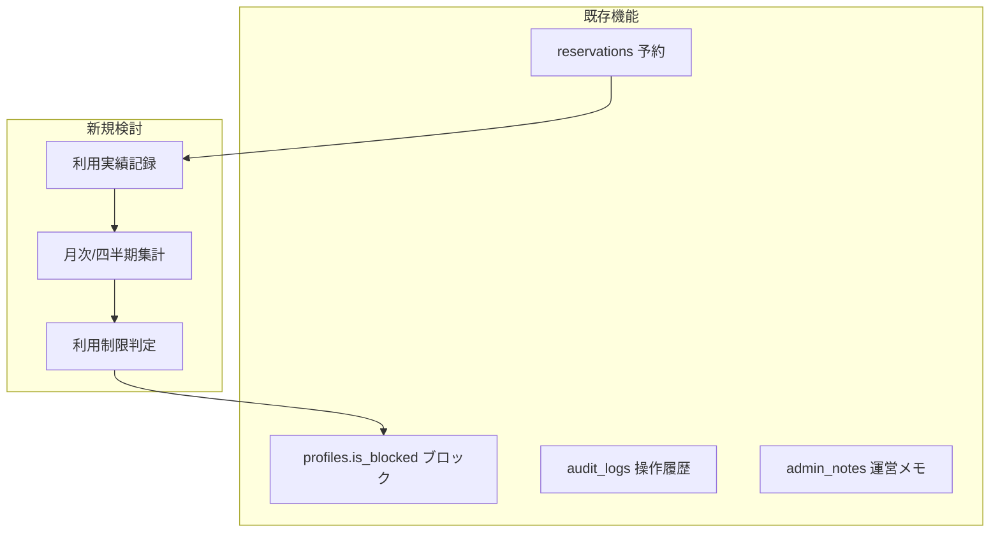

# 利用者実績記録（Utilization Records）機能 要件定義

## 📋 概要

管理者が予約枠ごとに**利用実績**（出席・欠席・マナー違反等）を記録し、直近過去四半期で集計して**問題の見える化**を行う機能です。利用制限の判定ロジックは未定のため、見える化までとする。利用制限をかけたユーザーにはその旨の表示を行う。

**主な目的：**
- 予約と実際の利用の乖離把握（無断キャンセル・欠席の検知）
- 利用率・稼働率の分析
- 管理者による利用状況の確認

---

## 1. 現行システムとの関係



- **reservations**: 予約枠（日付・時間・コート・user_id）
- **profiles.is_blocked**: 既存の利用制限（予約作成・変更・キャンセル不可）
- **admin_notes**: ユーザー単位の運営メモ（今回とは別用途）

---

## 2. 機能範囲

### 2.1 対象ユーザー

| ユーザー種別 | 利用記録に対する権限 |
|--------------|----------------------|
| **一般ユーザー** | 自分の予約に対する記録は参照のみ（または非表示） |
| **管理者** | 全件の参照・登録・編集・集計 |

### 2.2 記録対象の整理

#### 予約枠あたりの記録項目

| 項目 | 種別 | デフォルト値 | 説明 |
|------|------|--------------|------|
| 利用有無 | 分類 | 未記録 | 予約した枠を実際に利用したか |
| マナー状況 | 分類 | 違反なし | 利用時・利用後のマナー |
| メモ欄 | 自由記述 | — | 補足事項などの任意入力 |

#### 利用有無の取りうる値

| 値 | 説明 |
|----|------|
| 利用済 | 予約どおり利用した |
| 無断キャンセル | 事前連絡なく利用しなかった |
| 未記録 | 管理者がまだ記録していない（デフォルト） |

#### マナー状況の選択肢

- **違反なし**（デフォルト）
- 大声・音楽再生
- 利用時間超過
- ゴミの持ち帰り不備
- 喫煙の疑いあり
- 現状復旧不備
- マナー状況その他（自由記述で補足）

#### 記録タイミング

- 予約日を過ぎた後、管理者が**予約詳細画面**から記録
- 記録単位は**枠単位**（1予約1レコード）
- 入退館時刻はオプション検討（将来的に必要になった場合）

---

## 3. 四半期レビュー（見える化）

### 3.1 集計対象

- **対象期間**: 直近過去四半期のみ（例: 2025年Q1 = 1月〜3月）
- **集計内容**: ユーザーごとの以下の件数（見える化）
  - 無断キャンセル件数
  - マナー違反件数
  - マナー状況その他の件数

### 3.2 利用制限の判定

- **判定ロジックは未定**。閾値や自動ブロックは今回のスコープ外
- 集計結果の**見える化**までとし、管理者が手動で判断・ブロック実施

### 3.3 利用制限をかけた場合の表示

- 利用制限（profiles.is_blocked = true）がかかっているユーザーには**その旨を表示**する
- 表示箇所: ユーザー詳細、予約一覧での予約者名表示、集計画面など

---

## 4. データモデル

### 4.1 新規テーブル: utilization_records

| カラム | 型 | 説明 |
|--------|-----|------|
| id | UUID | PK |
| reservation_id | UUID | 予約ID（FK） |
| recorded_by | UUID | 記録者（管理者 profile id） |
| utilization_status | TEXT | 利用有無（used / no_show / unrecorded）。デフォルト: unrecorded |
| manners_status | TEXT | マナー状況（no_violation=違反なし・デフォルト、manners_other=マナー状況その他 等） |
| memo | TEXT | メモ欄（自由記述、任意） |
| created_at | TIMESTAMPTZ | 記録日時 |
| updated_at | TIMESTAMPTZ | 更新日時 |

- **1予約1レコード**（reservation_id に UNIQUE 制約）
- 既存の audit_logs とは別テーブル（用途が異なるため）
- **RLS**: utilization_records は管理者のみアクセス可能とする方針を検討

### 4.2 既存テーブルとの関係

```
reservations (予約)
    └── utilization_records (利用実績記録) [1:1 または 0..1]
```

### 4.3 画面・API

- **予約詳細（/admin/reservations/[id]）**: 利用実績の入力・表示フォームを追加
- **集計画面（新規）**: 月次/四半期でユーザー別集計一覧を表示（閾値超過者を強調）
- **API**: utilization_records の CRUD、集計用クエリ

---

## 5. 実装フェーズ

| フェーズ | 内容 |
|----------|------|
| **Phase 1** | 利用実績記録テーブル作成、予約詳細画面への記録UI追加 |
| **Phase 2** | 月次/四半期集計画面の追加 |
| **Phase 3** | 閾値超過者の一覧表示、ブロック操作との連携 |

---

## 6. 確認・検討事項

1. **利用有無の粒度**: 上記3値（利用済・無断キャンセル・未記録）で足りるか。より細かい区分が必要か。
2. **記録単位**: 1予約1レコードでよいか。同一日に複数枠を予約している場合の扱い。
3. **閾値**: 無断キャンセル・マナー違反の「何回で制限検討」とするか。
4. **集計周期**: 月次・四半期のどちらを優先するか、または両方対応するか。
5. **記録可能期間**: 予約日から何日後まで記録可能とするか（例: 7日以内）。
6. **Supabase Micro Compute**: 既存の Micro Compute 前提を維持し、集計クエリの負荷に配慮する。

---

## 7. 関連ドキュメント

- [09_mypage_requirements.md](./09_mypage_requirements.md) - マイページ機能要件
- [28_admin_usage_guide.md](./28_admin_usage_guide.md) - 管理者利用ガイド

---

*本ドキュメントは利用者実績記録要件整理を統合したものです。*
